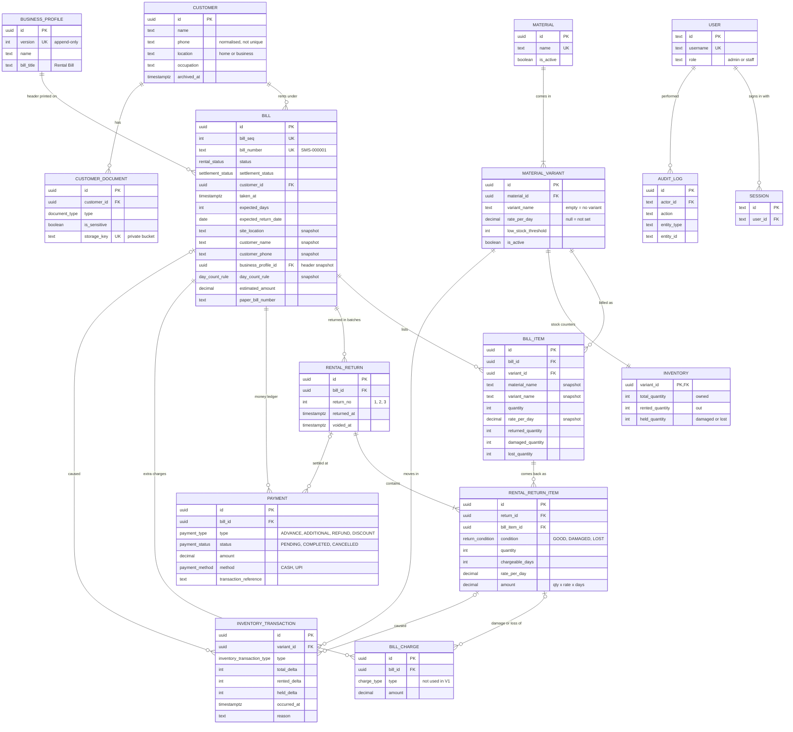

# SMS Associates — Database Design (V1)

**Status:** approved and implemented (Phase 2) · **Date:** 23 Sep 2026 · **Decisions:** see [ARCHITECTURE.md](ARCHITECTURE.md) (A1–A21)

| File | What it is |
|---|---|
| [`prisma/schema.prisma`](../prisma/schema.prisma) | The Prisma schema (Prisma 7.10): tables, enums, relations, indexes. |
| [`prisma/migrations/20260923180000_init/migration.sql`](../prisma/migrations/20260923180000_init/migration.sql) | The first migration: the DDL Prisma generates from the schema, followed by the rules its schema language can't express — the `pg_trgm` extension, CHECK constraints, the stock-ledger trigger, history guards and read-only views. |
| [`prisma/seed/`](../prisma/seed) | The seed: bill header version 1, the bill-number counter, and the catalog (§10). |
| [`database/erd.png`](database/erd.png) | Rendered copy of the ER diagram below. |

The design was validated on PostgreSQL 18 with a 103-scenario suite before implementation. Those scenarios, and the tests added in Phase 2, now run against real PostgreSQL on every CI run (§11).

---

## 1. ER diagram



The diagram shows the key columns only; the full definitions are in `schema.prisma`. For readability, a few relationships are left off the diagram: the actor ("done by") links from `USER`, and `INVENTORY_TRANSACTION`'s optional links to `BILL_ITEM`, `RENTAL_RETURN` and `CUSTOMER`.

<details>
<summary>Plain-text version</summary>

```
 Customer ──1:N──► Bill ◄──1:N── BusinessProfile
    │               │
    │ 1:N           ├──1:N──► Payment
    ▼               ├──1:N──► BillCharge
 CustomerDocument   ├──1:N──► RentalReturn ──1:N──► RentalReturnItem
                    │                                   ▲
                    └──1:N──► BillItem ───────1:N───────┘
                                ▲
                               1:N
                                │
 Material ──1:N──► MaterialVariant ──1:1──► Inventory
                      │
                     1:N
                      ▼
                InventoryTransaction  (also points to the Bill, BillItem, RentalReturn,
                                       RentalReturnItem and Customer behind each movement)

 User ──1:N──► Session, Account (Better Auth) · AuditLog · and "done by" on bills, returns,
               payments, charges, stock movements, customers, documents, profile versions
```

Arrows point from the "one" side to the "many" side.
</details>

## 2. Entities and relationships

| Entity (table) | Holds | Relationships |
|---|---|---|
| **User** (`users`) + Session, Account, Verification | Staff and admin accounts, in the shape Better Auth requires. `role` is `admin` or `staff`. Users are deactivated, never deleted. | Recorded as the actor on every business write. |
| **BusinessProfile** (`business_profiles`) | The bill header: name, tagline, address lines, phone numbers, bill title ("Rental Bill"). **Append-only, versioned.** | 1 profile version → N bills. Each bill keeps the version it was printed with. |
| **Counter** (`counters`) | The gap-free bill-number counter (`bill_number`). | Standalone. |
| **Customer** (`customers`) | Name, normalised phone (not unique), own location, occupation. Archived, never deleted, once they have bills. | 1 customer → N bills, N documents. |
| **CustomerDocument** (`customer_documents`) | Metadata for a photo or ID file kept in private storage. ID proofs are always marked sensitive. | N documents → 1 customer. |
| **Material** (`materials`) | A catalog entry such as "Muttu Maram". | 1 material → N variants. |
| **MaterialVariant** (`material_variants`) | What is actually stocked, priced and billed, such as "Muttu Maram – 10 Feet": daily rate, low-stock threshold. Materials without variants have one variant named `""`. | 1 variant → 1 inventory row, N bill lines, N stock movements. |
| **Inventory** (`inventory`) | Three counters per variant: `total` (owned), `rented` (out), `held` (damaged or lost, waiting for an admin). Available is calculated. | 1:1 with the variant. Changed only by the ledger trigger. |
| **InventoryTransaction** (`inventory_transactions`) | The **append-only stock ledger**: one row per movement, with its effect on the three counters, business time, entry time, reason and user. | N → 1 variant. Optionally → the bill, bill line, return, return line and customer that caused it. |
| **Bill** (`bills`) | One rental: number, rental status, settlement status, taking date/time, expected days, site location, notes, paper bill number, and **snapshots** (customer name/phone/location, header version, day-counting rule, time zone), plus lifecycle fields. | N → 1 customer, 1 header version. 1 bill → N lines, N returns, N payments, N charges. |
| **BillItem** (`bill_items`) | One variant on a bill: **snapshot** of material name, variant name and rate; quantity; estimate; running totals of returned, damaged and lost pieces. | N → 1 bill, 1 variant. 1 line → N return-batch lines. Unique per (bill, variant). |
| **RentalReturn** (`returns`) | One **return event** (batch): return number within the bill, return date/time, notes, who processed it, void fields. | N → 1 bill. 1 return → N return lines, N payments recorded at that return. |
| **RentalReturnItem** (`return_items`) | How many pieces of one bill line came back in one batch, and in what condition (GOOD, DAMAGED or LOST), with that batch's chargeable days, rate and amount. | N → 1 return and 1 bill line. |
| **Payment** (`payments`) | The **money ledger**: ADVANCE, ADDITIONAL, REFUND or DISCOUNT; PENDING, COMPLETED or CANCELLED; amount; Cash or UPI; UPI reference. | N → 1 bill. Optionally → the return where it was settled. |
| **BillCharge** (`bill_charges`) | Non-rental charges (damage, loss, other). **In the model for the future; not used in V1.** | N → 1 bill. Optionally → the damaged or lost return line. |
| **AuditLog** (`audit_logs`) | Append-only record of important actions. It also feeds Recent Activity. | N → 1 actor. Points at any entity by type and id. |

Naming: the return tables are `RentalReturn` and `RentalReturnItem` in code, because `return` is a reserved word in TypeScript. In the database they are `returns` and `return_items`, as in the PRD.

## 3. Inventory model

**Three counters per variant, one formula:**

```
available = total − rented − held          (calculated, never stored, never edited)
```

| Counter | Meaning |
|---|---|
| `total_quantity` | Pieces SMS Associates owns, including those out and those held |
| `rented_quantity` | Pieces with customers right now |
| `held_quantity` | Pieces returned damaged, or reported lost, that an admin hasn't resolved yet (decision A3). They are kept out of available stock. |

**Every movement is a ledger row, and each movement type has one fixed effect.** A CHECK constraint enforces the effects:

| Type | total | rented | held | Caused by |
|---|---|---|---|---|
| `INITIAL_STOCK` | +n | | | Admin sets opening stock |
| `MANUAL_ADJUSTMENT` | ±n | | | Admin: purchase, scrapping yard stock, stock-count correction (reason required) |
| `RENTAL_OUT` | | +n | | Bill generated (one row per line) |
| `RETURN_IN` | | −n | | Pieces returned in good condition |
| `RETURN_TO_HOLD` | | −n | +n | Pieces returned damaged, or reported lost |
| `HOLD_RELEASE` | | | −n | Admin: repaired, or found — back to available |
| `HOLD_WRITE_OFF` | −n | | −n | Admin: scrapped or confirmed lost |
| `BILL_VOID_REVERSAL` | | −n | | Admin voided a generated bill |
| `RETURN_VOID_REVERSAL` | | +n | −n or 0 | Admin voided a return |

**How the database enforces it:**
- Inserting a ledger row is the **only** way to change stock. An `AFTER INSERT` trigger applies the row to the counters. A direct `UPDATE` of the counters is refused, inventory rows start at zero, and they are never deleted.
- CHECK constraints keep `0 ≤ rented`, `0 ≤ held` and `rented + held ≤ total`. If a bill asks for more than is available, the generation fails and everything in that transaction rolls back: the bill stays a draft and nothing is kept.
- The ledger is append-only. Mistakes are corrected with new movements, never by editing old ones.
- Three views should always be empty: `inventory_discrepancies`, `rented_stock_discrepancies` and `bill_item_return_discrepancies`. A scheduled check and the test suite watch them.

**Low stock** (A16): `low_stock_threshold` is set and `available ≤ low_stock_threshold`. **Available stock %** = Σ available ÷ Σ total × 100.

**Rented while two people bill at once:** the service locks the variants' inventory rows (`SELECT … FOR UPDATE`, in a fixed order), checks every line so it can show a per-line shortage message, and then inserts the ledger rows. The CHECK constraint is the final backstop that makes overselling impossible, even if the application has a bug.

## 4. Bills: lifecycle, statuses and snapshots

```
                 ┌─────────► CANCELLED (draft cancelled — staff or admin, no reason needed)
   step 1 saved  │
 ─────────────► DRAFT ──generate──► ACTIVE ──partial return──► PARTIALLY_RETURNED ──last pieces──► RETURNED
 (number taken)                       │  └──────────── everything back in one go ─────────────────────▲
                                      └──────► CANCELLED (voided by admin, reason required, stock reversed)
```

- **Bill number** (A4): taken from `counters` when step 1 is saved, in the same transaction that creates the draft. It never changes and is never reused, and nothing is ever deleted, so every number stays accounted for. The format is `SMS-` + 6 digits and grows to 7 after SMS-999999. The database checks that the number matches its sequence value.
- **Draft**: lines and snapshots can change freely. No stock moves and no payment exists. The wizard's step-3 payment input sits in `draft_advance_*` columns, which must be empty once the bill leaves DRAFT.
- **Generation** (one transaction): refresh the snapshots from current master data, lock the inventory rows, write one `RENTAL_OUT` per line, write the ADVANCE payment (if the amount is above zero), set status to ACTIVE, write the audit entry.
- **After generation** (A6) the database refuses changes to the customer, taking date/time, snapshots, lines, quantities and rates. Only `site_location`, `notes` and `expected_days` (admin, audited) remain editable. When the expected days change, the estimates are recalculated.
- **Void** (admin, A6): allowed while the bill has no un-voided returns. If returns exist, void them first, newest first. The void sets CANCELLED with a reason, adds `BILL_VOID_REVERSAL` movements, cancels pending payments, and leaves any money received showing as REFUND_DUE until the refund is recorded. The number is kept.
- **Archive** (admin, A13): only RETURNED or CANCELLED bills. It hides the bill from default lists; nothing is deleted.

**Rental status is derived from the line totals** (`domain/bill-status.ts`):

```
pending(line) = quantity − returned − damaged − lost
all lines pending = 0            → RETURNED
some pieces accounted for        → PARTIALLY_RETURNED
nothing accounted for            → ACTIVE
```

**Overdue** (for "Pending Returns", A16): status is ACTIVE or PARTIALLY_RETURNED and today (IST) is after `expected_return_date`.

**Settlement status** (A8) is separate from rental status. It is recomputed from the ledger in the same transaction as every return, payment or void (`domain/settlement.ts`):

| Settlement status | When |
|---|---|
| `NO_DUE` | Draft or cancelled draft; materials still out with no promised payment outstanding; voided bill where no money ever changed hands |
| `PAYMENT_PENDING` | Materials still out, and a promised payment ("Payment Not Yet") hasn't been received |
| `ADDITIONAL_DUE` | Bill RETURNED (or voided) and the balance is above zero: the customer owes money |
| `REFUND_DUE` | Bill RETURNED or voided and the balance is below zero: the business owes money |
| `SETTLED` | Bill RETURNED or voided, money was involved, and the balance is zero |

## 5. Returns (A2, A3)

- A bill can have **any number of return events**. Each is one `RentalReturn`, with its own return date and time (stored as one timestamp and entered as IST date + time) and a return number (1, 2, 3 …).
- Each event has one `RentalReturnItem` per (bill line, condition). For example, return 2 of SMS-000001 below holds "3 GOOD" and "2 DAMAGED" for the same line.
- **Chargeable days** (A1) = `max(1, return date − taking date)`, using Asia/Kolkata calendar dates. Times are stored and shown but don't change the count. Every bill stores its rule (`day_count_rule`, `time_zone`), so a future rule change never alters old bills.
- **Batch amount** = quantity × the line's snapshot rate × chargeable days. The database checks that the stored amount equals this product.
- DAMAGED and LOST pieces need a note. They are charged rent up to that return date like any other batch, go to *held* stock, and are resolved later by an admin (`HOLD_RELEASE` or `HOLD_WRITE_OFF`). Extra damage or loss charges are **not calculated in V1**. When needed later, they go in `bill_charges` with no redesign.
- Each line's running totals (`returned`, `damaged`, `lost`) are updated in the same transaction as the return. A CHECK stops them exceeding the quantity taken. Concurrency is covered too: the bill row is locked first, and an idempotency key stops the same form being saved twice.
- The original bill is **updated, never replaced**: same number, and its status moves automatically. The bill view and PDF list every return event.
- A wrong return is corrected by an admin **voiding the latest return** (with a reason). This adds `RETURN_VOID_REVERSAL` movements and subtracts the line totals. The return rows stay in history.

## 6. Money: ledger-based payments (A7, A9)

Every movement of money is its own `Payment` row. No stored "total paid" exists anywhere.

| Type | Direction | Notes |
|---|---|---|
| `ADVANCE` | in | Created at generation from the step-3 input. "Payment Finished" → COMPLETED; "Payment Not Yet" → PENDING. An advance of ₹0 creates no row. |
| `ADDITIONAL` | in | Usually at the final return; staff may also record one mid-rental (A2). |
| `REFUND` | out | When money is handed back. Recorded as COMPLETED only; "refund due" is a settlement status, not a row. |
| `DISCOUNT` | — | An admin waiver with a required reason, and no payment method (A9). In the model; no prominent V1 screen. |

- Rows are never deleted, and their bill, type, amount and note never change. Status moves only PENDING → COMPLETED/CANCELLED or COMPLETED → CANCELLED, and cancelling needs a reason. The payment method, UPI reference and received time can be filled in only when a pending payment is actually received. These rules are enforced by a trigger.
- **PENDING money is never counted as received.**
- The view `bill_financials` always calculates each bill's money from the ledgers:

```
rental_charges = Σ amount of the bill's return lines (voided returns excluded)
extra_charges  = Σ bill_charges not voided                       (always 0 in V1)
received       = Σ COMPLETED ADVANCE + ADDITIONAL
refunded       = Σ COMPLETED REFUND
discounts      = Σ COMPLETED DISCOUNT
balance        = rental_charges + extra_charges − discounts − (received − refunded)
                 > 0 → customer owes · < 0 → refund due · final once RETURNED or voided
```

## 7. Keeping old bills exactly as issued

| Printed on the bill | Preserved in | Why it can't change later |
|---|---|---|
| Customer name, phone, location | `bills.customer_name/phone/location` | Copied at generation; locked by trigger. Editing the profile doesn't touch them. |
| Site location | `bills.site_location` | Stored per bill; editable only by an admin, and audited (A6) |
| Company header and phone numbers, bill title | `bills.business_profile_id` → an **append-only** profile version | Editing company details inserts a new version; old bills keep theirs |
| Material and variant names | `bill_items.material_name/variant_name` | Copied at generation; locked. Catalog renames don't touch them. |
| Daily rate | `bill_items.rate_per_day` (and on each return line) | Locked after generation; catalog rate changes affect only new bills |
| Expected duration, estimate | `bills.expected_days`, `bills/bill_items.estimated_amount` | Kept after return; actual durations live on the return lines. Editable only by an admin, and audited. |
| Day-counting rule | `bills.day_count_rule`, `bills.time_zone` | Locked; returns on this bill always use it |
| Returns, amounts, payments | `returns`, `return_items`, `payments` | Append-only or status-only; corrections add new records |

Links to the live customer and variant are kept, so history, search and reports still work. The bill is simply never printed from them. Materials, variants and customers with history are deactivated or archived, never deleted.

## 8. Integrity enforced by the database

- **Foreign keys** on every business table use `ON DELETE RESTRICT`, so no delete can cascade history away.
- **Unique:** bill number and sequence; one line per variant per bill; one variant name per material; idempotency keys on returns and payments; document storage key; profile version.
- **CHECK constraints** (58): normalised Indian mobile numbers (`^[6-9][0-9]{9}$`), positive quantities and days, non-negative rates and amounts, bill number ↔ sequence, the effect of each movement type, returns ≤ taken, batch amount = qty × rate × days, required reasons (void, cancel, discount, admin movements, damaged or lost notes), status/field consistency (generation, cancellation, archive, draft-only fields).
- **Triggers:** the stock ledger drives the counters; direct stock edits are refused; append-only tables (stock ledger, audit log, profile versions, return lines); counters only move forward; bills are never deleted and are frozen after generation; lines are locked after generation; returns can only be voided; payments can only change status.
- **Not blocked:** `TRUNCATE` (an operator action, used by test resets) and changes made by the database owner. Production uses a separate app role, set up in Phase 15.

## 9. Worked example (PRD numbers)

These rates (₹5 and ₹8 per day) are the PRD's examples, not real prices. The same scenario runs in the test suite.

**SMS-000001:** Shanjiv takes materials on 23 Sep at 10:00 for an expected 2 days, and pays a ₹500 cash advance.

| Line | Taken | Rate | Estimate |
|---|---|---|---|
| Muttu Maram – 10 Feet | 20 | ₹5 | 20 × 5 × 2 = ₹200 |
| Runner – 10 Feet | 10 | ₹8 | 10 × 8 × 2 = ₹160 |

| Return | When | Batch lines | Days | Amount |
|---|---|---|---|---|
| 1 | 26 Sep 17:30 | Muttu Maram 15 GOOD · Runner 10 GOOD | 3 | 225 + 240 = ₹465 |
| 2 | 28 Sep 09:00 | Muttu Maram 3 GOOD · 2 DAMAGED ("two props bent") | 5 | 75 + 50 = ₹125 |

Status: ACTIVE → PARTIALLY_RETURNED → RETURNED. Rental charges: **₹590**. Advance: ₹500. Balance ₹90, so ADDITIONAL_DUE. A ₹90 UPI payment then makes it **SETTLED**.

**Muttu Maram – 10 Feet stock** (200 owned):

| Movement | total | rented | held | available |
|---|---|---|---|---|
| RENTAL_OUT +20 (SMS-000001) | 200 | 20 | 0 | 180 |
| RETURN_IN −15 (return 1) | 200 | 5 | 0 | 195 |
| RETURN_IN −3 (return 2) | 200 | 2 | 0 | 198 |
| RETURN_TO_HOLD 2 (return 2, damaged) | 200 | 0 | 2 | 198 |
| HOLD_WRITE_OFF 1 (admin: beyond repair) | 199 | 0 | 1 | 198 |
| HOLD_RELEASE 1 (admin: repaired) | 199 | 0 | 0 | 199 |

**Payments ledger:** ADVANCE ₹500 CASH COMPLETED → ADDITIONAL ₹90 UPI COMPLETED (reference UPI-424242, recorded at return 2).

## 10. Seed data (A15 — no invented values)

The seed creates business profile version 1 with the PRD's details (title "Rental Bill"), the counter `bill_number = 0`, and the catalog below, using the **exact PRD spellings**. Rates, stock and thresholds are **not invented**:
- `rate_per_day = NULL` — "rate not set". The variant can't be put on a bill until an admin sets a rate.
- No `INITIAL_STOCK` movement — stock shows 0 until an admin enters the real count.
- `low_stock_threshold = NULL` — no low-stock alert until one is set.

Everything is counted in whole pieces. The first admin account is created by a one-off script (Phase 3), not stored in the seed.

| # | Material | Variant | Rate/day | Total stock | Low-stock threshold |
|---|---|---|---|---|---|
| 1 | Big Jockey | 16 Feet | TODO | TODO | TODO |
| 2 | Big Jockey | 18 Feet | TODO | TODO | TODO |
| 3 | Small Jockey | 12 Feet | TODO | TODO | TODO |
| 4 | Big Span | 16 Feet | TODO | TODO | TODO |
| 5 | Small Span | 13 Feet 6 Inch | TODO | TODO | TODO |
| 6 | Centering Seats | 4 × 2 | TODO | TODO | TODO |
| 7 | Centering Seats | 3 × 2 | TODO | TODO | TODO |
| 8 | Centering Seats | 3 × 1½ | TODO | TODO | TODO |
| 9 | Centering Seats | 5 × ½ | TODO | TODO | TODO |
| 10 | Column Box | 4 × ¾ | TODO | TODO | TODO |
| 11 | Column Box | 4 × ½ | TODO | TODO | TODO |
| 12 | Column Box | 4 × 1 | TODO | TODO | TODO |
| 13 | Column Box | 3 × ¾ | TODO | TODO | TODO |
| 14 | Column Box | 8 × ¾ | TODO | TODO | TODO |
| 15 | Muttu Maram | 12 Feet | TODO | TODO | TODO |
| 16 | Muttu Maram | 11 Feet | TODO | TODO | TODO |
| 17 | Muttu Maram | 10 Feet | TODO | TODO | TODO |
| 18 | Muttu Maram | 8 Feet | TODO | TODO | TODO |
| 19 | Muttu Maram | 7 Feet | TODO | TODO | TODO |
| 20 | Muttu Maram | 5 Feet | TODO | TODO | TODO |
| 21 | Runner | 10 Feet | TODO | TODO | TODO |
| 22 | Runner | 8 Feet | TODO | TODO | TODO |
| 23 | Palagai | 10 Feet | TODO | TODO | TODO |
| 24 | Palagai | 8 Feet | TODO | TODO | TODO |
| 25 | Earthramer | — | TODO | TODO | TODO |
| 26 | Vibrator | — | TODO | TODO | TODO |
| 27 | Spanner | — | TODO | TODO | TODO |
| 28 | Bolt | — | TODO | TODO | TODO |

## 11. Verification

**Design stage.** `prisma validate` and `prisma format --check` pass with Prisma 7.10 (the current stable release; 8.0 is still a release candidate). The DDL Prisma generates (19 tables, 10 enum types, 46 indexes, 38 foreign keys) plus the rules ran cleanly on PostgreSQL 18, with a 103-scenario suite.

**Permanent tests (Phase 2).** Integration tests run against a real PostgreSQL server: PostgreSQL 17 in CI, and any local server via `DATABASE_URL`. The test run applies the real migrations with `prisma migrate deploy` to a template database. Each test file then gets its own copy, which is dropped afterwards. Nothing touches the development database's data.

| Suite (`tests/integration/`) | What it proves |
|---|---|
| `database-rules.test.ts` | The **103 validated scenarios**, in SQL. They cover the SMS-000001 walk-through (§9) plus every guard: <br>• no direct stock edits; inventory rows start at zero<br>• overselling refused and the whole generation rolled back; stock never below what is out<br>• returns ≤ taken; batch amount = qty × rate × days; a note required for damaged or lost pieces; duplicate return submissions refused<br>• returns can be voided, not edited<br>• lines, rates, customer snapshot and taking date locked after generation; bills never deleted and never back to draft; site location, notes and expected days still editable<br>• bill number tied to its sequence and widening past 999999; the counter only moves forward<br>• payment amounts immutable and payments undeletable; valid status transitions only, with reasons; pending money never counted as received; discount rules<br>• held-stock release and write-off; void with stock reversal; cancellation final; archive rules<br>• append-only ledgers; profile versioning; ID proofs always sensitive<br>• Tamil text and `3 × 1½` stored exactly; trigram search ("Sanjiv" → "Shanjiv"); IST day counting<br>• all three discrepancy views empty at the end |
| `migrations.test.ts` | The migration builds exactly the design: 19 tables, 10 enums, 58 CHECKs, 38 foreign keys, 11 triggers, 4 views, `pg_trgm` and its indexes. `prisma migrate diff` finds **no drift** between the migrated database and `schema.prisma`, and `prisma migrate status` reports it up to date. |
| `seed.test.ts` | The exact PRD catalog: 13 materials and 28 variants, in PRD order, spelled as in the PRD ("Earthramer"). No rates, thresholds or stock. Profile v1 "Rental Bill"; counter at 0; safe to re-run, and never overwrites values entered later. |
| `bill-number.test.ts` | `allocateBillNumber` through Prisma: SMS-000001 onwards. A failed save doesn't use up a number. **30 concurrent saves**, a third of them failing, get consecutive numbers with no gaps. Numbers widen to SMS-1000000; the counter can't move back. |
| `concurrency.test.ts` | Real overlapping transactions on separate connections:<br>• two bills for the last pieces: the second waits for the first's lock, then is refused<br>• 10 bills racing for 20 pieces: exactly 6 × 3 succeed<br>• bills listing materials in opposite orders: no deadlock<br>• double-submitted and simultaneous returns of the same pieces: only one counted<br>• 20 simultaneous adjustments: none lost<br>• simultaneous write-downs: never below what is out<br>• ledgers consistent afterwards |
| `settlement.test.ts` | The `bill_financials` view equals the domain calculation (`src/domain/settlement.ts`) on every bill. The rental and settlement statuses follow the rules through:<br>• the §9 example (₹590 − ₹500 → ₹90 due → settled)<br>• PRD §37 refund (₹500 − ₹350) and §38 extra (₹650 − ₹500)<br>• a "Payment Not Yet" advance, and a ₹0 advance<br>• a voided return; an admin discount<br>• a voided generated bill (advance → refund due); a cancelled draft |
| `snapshots.test.ts` | Through Prisma: customer, material, rate and bill-header snapshots stay unchanged after the master data changes. Changing a snapshot, line, rate or profile version is refused. An admin edit of notes, site and expected days succeeds, with an append-only audit entry. A stale edit is refused (optimistic locking). |

The pure rules (money in paise, IST day counting, pricing, stock, statuses, settlement, bill-number format, phone normalisation) have unit tests in `tests/unit/domain/`.

**Limits of what the database enforces.** The database can't know who the signed-in user is. ADMIN-only actions — voids, discounts, edits of a generated bill, stock adjustments — are enforced by the permission check in each server action (Phase 3 onwards), and written to the audit log in the same transaction. Rules that span several rows (for example "void the newest return first", or "a bill can be voided only after its returns are voided") are enforced by the services that perform them (Phases 9–12). The database still refuses any result that would leave stock, returns or money inconsistent.

## 12. Indexes and search (A17)

| Search / list | Index |
|---|---|
| Customer by name or location (partial, misspelt) | trigram GIN on `customers.name`, `customers.location` |
| Customer or bill by phone | `customers.phone`, `bills.customer_phone` (both normalised) |
| Bill by number | unique `bills.bill_number` ("124", "sms124" and "SMS-000124" are parsed to the number) |
| Bill by customer, site location | trigram GIN on `bills.customer_name`, `bills.site_location`; `bills(customer_id, taken_at)` |
| By taking date or date range | `bills.taken_at` (IST day boundaries converted in the app) |
| By return date | `returns.returned_at` |
| By status; Pending List; overdue | `bills(status, expected_return_date)`; `bills.settlement_status` |
| Stock movements of a variant | `inventory_transactions(variant_id, occurred_at)` |
| Audit trail of a record; Recent Activity | `audit_logs(entity_type, entity_id, created_at)`, `audit_logs(action, created_at)` |

## 13. Differences from the PRD's suggested model (§49–§56)

| PRD | This design | Why |
|---|---|---|
| `Bill.takingDate` + `takingTime`, `Return.returnDate` + `returnTime` | One timestamp each (`taken_at`, `returned_at`), still entered and shown as date + time | One source of truth; avoids time-zone bugs |
| `BillItem.expectedDays` | Only `Bill.expected_days` | One expected duration per bill (PRD §17); no duplicate to keep in sync |
| `BillItem.actualDays`, `actualAmount` | `chargeable_days` and `amount` on each **return line** | A line returned in several batches has several durations (A2) |
| `Bill.advanceAmount`; `Return.actualAmount/refundAmount/additionalAmount` | Calculated from the payment ledger and return lines (`bill_financials`) | Payments are ledger-based; no stored totals |
| `Inventory.totalQuantity` | + `rented_quantity`, `held_quantity`, changed only by the ledger trigger | Available = total − rented − held; damaged/lost kept out (A3) |
| `InventoryTransaction.quantity` | `total_delta`, `rented_delta`, `held_delta`; more references; business time vs. entry time | Each movement's exact effect; back-dated paper bills |
| 4 movement types | 9 (adds return-to-hold, hold release/write-off, void reversals) | A3, A6, return corrections |
| Payment statuses PENDING, COMPLETED | + CANCELLED; types ADVANCE, ADDITIONAL, REFUND, DISCOUNT | Correct mistakes without deleting; refunds and waivers are ledger entries |
| `Return`, `ReturnItem` | `RentalReturn`, `RentalReturnItem` in code (tables `returns`, `return_items`) | `return` is reserved in TypeScript |
| — | `BusinessProfile` (versioned), `Counter`, `BillCharge`, `AuditLog`, Better Auth tables | Header snapshot, gap-free numbers, future damage charges, §64 audit, login |
| — | `status` + `settlement_status`, snapshots, `paper_bill_number`, `version`, who/when fields | A8, historical accuracy, A14, safe concurrent edits, audit |

## 14. Ready for later, not built in V1

| Later feature | How it fits without a redesign |
|---|---|
| Damage/loss charges | `bill_charges` (DAMAGE, LOSS) linked to the return line; already in `bill_financials` |
| Discounts/waivers workflow | `payments.type = DISCOUNT` with a required reason |
| GST | Add GSTIN to `business_profiles` and tax columns or a tax-line table; old bills keep "Rental Bill" through their profile version |
| Multi-branch | `branch_id` on bills and inventory, plus a counter key per branch |
| Reminders, notifications | `bills.expected_return_date` is indexed; add a job queue |
| WhatsApp/SMS bill sharing | The PDF renders from stored snapshots; add expiring share links |
| Barcode/QR | A code column on `material_variants` |
| More roles | `users.role` plus the permission map in code |
